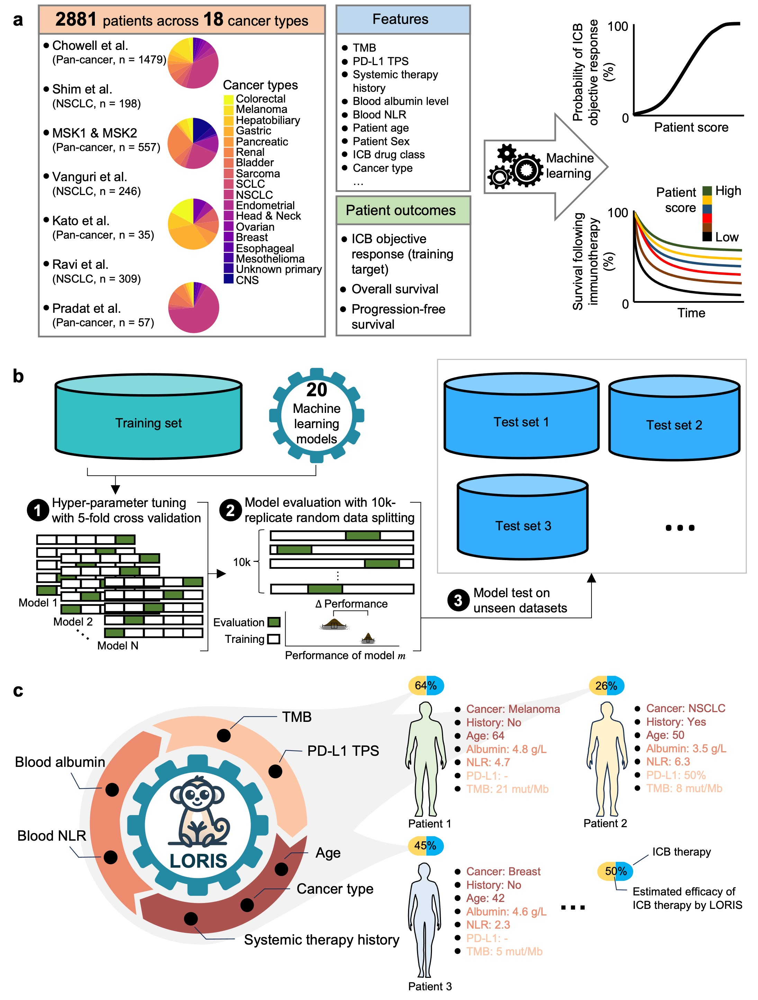

## LORIS (A LOgistic Regression-based Immunotherapy-response Score)

This is a repository of scripts for reproducing the paper titled "LORIS robustly predicts patient outcomes with immune checkpoint blockade therapy using common clinical, pathologic, and genomic features" by Chang et al. (Nature Cancer 2024)

<p align="center">
  
</p>
<b>Figure: Overview of this work</b>. <b>a</b>. The data. <b>b</b>. Model building, training, and evaluation. <b>c</b>. LORIS facilitates the estimation of ICB efficacy for individual patients.


Briefly, in this work, Chang et al. developed a new clinical score called the LOgistic Regression-based Immunotherapy-response Score (LORIS) using a transparent and concise 6-feature logistic regression model. LORIS outperforms previous signatures in ICB response prediction and can identify responsive patients, even those with low tumor mutational burden or tumor PD-L1 expression. Importantly, LORIS consistently predicts both objective responses and short-term and long-term survival across most cancer types. Moreover, LORIS showcases a near-monotonic relationship with ICB response probability and patient survival, enabling more precise patient stratification across the board. As the method is accurate, interpretable, and only utilizes a few readily measurable features, it could help improve clinical decision-making practices in precision medicine to maximize patient benefit. Specifically, the LORIS can be calculated as follows:

<b>Method 1: Pan-cancer LORIS</b>

```
LORIS = 1 / (1 + e^(-S))

S = 0.0371 * min(TMB, 50) - 0.8775 * PSTH + 0.5382 * Albumin - 0.033 * min(NLR, 25) + 0.0049 * min(Age, 85) + CTCT - 2.0886

CTCT = - 0.3323 * Bladder - 0.3323 * Breast - 0.102 * Colorectal - 0.0079 * Endometrial + 0.55 * Esophageal + 0.2306 * Gastric
    + 0.0678 * Head&Neck - 0.1189 * Hepatobiliary - 0.0086 * Melanoma + 0.1255 * Mesothelioma + 0.0008 * NSCLC
    - 0.052 * Ovarian - 1.1169 * Pancreatic + 0.5451 * Renal + 0.0542 * Sarcoma - 0.0033 * SCLC
```

where PSTH is a patient’s systemic therapy history (if a patient received chemotherapy or targeted therapy before ICB therapy, its value is 1, otherwise its value is 0); CTCT is the cancer type calibration term (for a patient, the value of the cancer type he/she has been diagnosed is 1, all other cancer types are 0). 

Other features: TMB, measured by panel sequencing (mut/Mb, typical value range 0-50); Albumin (g dL-1); NLR, ratio between absolute counts of blood neutrophils and lymphocytes. 


<b>Method 2: NSCLC-specific LORIS</b>

```
LORIS = 1 / (1 + e^(-S))

S = 0.0353 * min(TMB, 50) + 0.0111*PDL1 - 0.375 * PSTH + 0.2924 * Albumin - 0.0103 * min(NLR, 25) - 1.5593
```

Features: PDL1, PD-L1 tumor proportion score (%, value range 0-100).

## Scripts

The enclosed scripts are designed to faithfully reproduce all the results presented in the original paper.

### 1. Pan-cancer cohort cancer type composition pie plot

`01.cohortCancerComposition_piePlot.Rmd`

### 2. Characterization of patients in different ICB cohorts

`02.ICBcohortsPatientCharacterization_table.Rmd`

### 3. Correlation analysis of features that are measured on a continuous scale

`03.PanCancer_continuousFeatureCorrelation_heatmap.py`

### 4. Pan-cancer logistic regression: feature selection and feature importance

`04.PanCancer_FeaturetImportance.py`

### 5. Pan-cancer model comparison: training and evaluation of different models

`05_1.PanCancer_20Models_HyperParams_Search.py`

`05_2.PanCancer_20Models_evaluation.py`

Note: One may use `batchSubmit.py` and `jobscript.sh` to submit batch jobs to server for model hyperparameter search and/or evaluation.

`05_3.TabNet_paramSearch_evaluation.py`

`05_4.PanCancer_20Models_evaluation_stat.py`

`05_5.PanCancer_LLRx_ParamCalculate.py`

`05_6.PanCancer_LLR6_RF16NBT_Performance_compare.py`

`05_7.PanCancer_LLR6_RF16NBT_AUC_compare.py`

`05_8.PanCancer_LLR6_RF6_TMB_thresholds_on_train.Rmd`


### 6. Pan-cancer external validation of LLR6, RF6 and TMB

`06_1.PanCancer_LLR6_RF6_TMB_multiMetric_compare.py`

`06_2.PanCancer_LLR6_RF6_TMB_ViolinPlot_compare.py`

`06_3.PanCancer_LLR6_vs_LLR6noCancerTerm_ROC_AUC.py`

`06_4.PanCancer_LLR6_vs_LLR5noPSTH_ROC_AUC.py`

`06_5.PanCancer_vs_nonNSCLC_LLR6_ROC_AUC.py`

### 7. Pan-cancer prediction of patient survival following ICB or non-ICB treatments by LLR6; monotonic relationship between LORIS and patient ICB response and survival

`07_1.PanCancer_LORIS_TMB_vs_resProb_curve.py`

`07_2.PanCancer_LORIS_TMB_survivalAnalysis_ICB.Rmd`

`07_3.PanCancer_LORIS_ROC_AUC_nonICB_vs_ICB_OS.py`

`07_4.PanCancer_LR5noTMB_LORIS_ROC_AUC_nonICB_vs_ICB_OS.py`

`07_5.PanCancer_LORIS_TMB_survivalAnalysis_nonICB.Rmd`

`07_6.PanCancer_LORIS_K-Mcurve_individualCancers_ICB.Rmd`


### 8. NSCLC-specific model comparison: training and evaluation of different machine-learning models

`08_1.NSCLC_20Models_HyperParams_Search.py`

`08_2.NSCLC_20Models_evaluation.py`

Note: One may use `batchSubmit.py` and `jobscript.sh` to submit batch jobs to server for model hyperparameter search and/or evaluation.

`08_3.NSCLC_20Models_evaluation_stat.py`

`08_4.NSCLC_LLRx_10k_ParamCalculate.py`


### 9. NSCLC-specific external validation of LLR6

`09_1.NSCLC_LLR6_PDL1_TMB_multiMetric_compare.py`

`09_2.NSCLC_LLR6_PDL1_TMB_ViolinPlot_compare.py`

`09_3.NSCLC_vs_PanCancer_LLR6_ROC_AUC.py`

`09_4.NSCLC_LLR6_vs_LLR2_ROC_AUC.py`

`09_5.NSCLC_LLR6_vs_LLR5noPSTH_ROC_AUC.py`

### 10. Hazard ratio prediction of patient survival following ICB by NSCLC-specific LLR6

`10.NSCLC_LORIS_PDL1_TMB_ForestPlot_individualDatasets.Rmd`


### 11. Predictive power of NSCLC-specific LLR6 model in other cancer types

`11.NSCLC_LLR6_on_otherCancers_ROC_AUC.py`

### 12. Pan-cancer & NSCLC-specific formulas for LORIS calculation

`12.Formula_LORIS.py`


## Citation
**Chang, TG., Cao, Y., Sfreddo, H.J. et al.** *LORIS robustly predicts patient outcomes with immune checkpoint blockade therapy using common clinical, pathologic and genomic features*. **Nat Cancer** 5, 1158–1175 (2024). [https://doi.org/10.1038/s43018-024-00772-7](https://doi.org/10.1038/s43018-024-00772-7)


## Related links
[Nature Cancer: News & Views](https://www.nature.com/articles/s43018-024-00802-4)

[Research Communities "Behind the Paper" blog post](https://communities.springernature.com/posts/developing-a-clinically-translational-ai-model-to-predict-immunotherapy-response)

[Introduction of the work on X (formerly Twitter)](https://x.com/NCIEytanRuppin/status/1797646325338849281)

[NCI CBIIT News](https://datascience.cancer.gov/news-events/news/interpretable-ai-helps-predict-effectiveness-immunotherapy)

[NCI News Release](https://www.cancer.gov/news-events/press-releases/2024/ai-tool-predicts-response-to-immunotherapy)

[NCI Podcast "Inside Cancer Careers": AI and Immunotherapy—A Breakthrough in Cancer Treatment](https://www.cancer.gov/grants-training/training/inside-cancer-careers/season-2-episode-15)

[Cancer HealthCast: "This AI Tool Could Predict a Patient’s Response to Immunotherapy"](https://govciomedia.com/this-ai-tool-could-predict-a-patients-response-to-immunotherapy/)

The pan-cancer LORIS tool is available online at [LORIS_NCI](https://loris.ccr.cancer.gov/).

An online calculator featuring all four models—pan-cancer LLR6, pan-cancer LLR5 (without patient systemic therapy history), NSCLC-specific LLR6, and NSCLC-specific LLR5 (without patient systemic therapy history)—is available at [LORIS_web](https://rootchang.github.io/LORIS_web/).


## Contact
Dr. Eytan Ruppin: <eytan.ruppin@nih.gov>; [Lab page](https://ccr.cancer.gov/staff-directory/eytan-ruppin/). 

Dr. Luc Morris: <morrisl@mskcc.org>; [Lab page](https://www.mskcc.org/research-areas/labs/luc-morris/). 


Dr. Tiangen Chang: <tiangen.chang@nih.gov>; [Google scholar](https://scholar.google.com/citations?user=9PM5gWIAAAAJ&hl=en/). 
